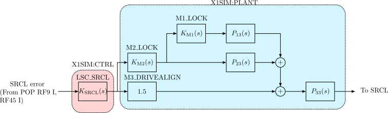

# Simulating LIGO Livingston SRCL loop with rtsfreerun

## Dependencies

conda
- cmake
- spdlog
- pybind11
- pyyaml

conda-forge
- python-foton

pypi
- cdsutils

git clone
- [rtsfreerun](https://git.ligo.org/christopher.wipf/rtsfreerun.git)

Scripts also use [Kontrol](https://github.com/terrencetec/kontrol) and
[VISHack](https://github.com/gw-vis/vishack) to convert foton filters,
model spectrums, and load DTT data.

### Example Conda environment
The following set up ensures the scripts to be run smoothly.

```
conda create -n rtsfreerun -c conda-forge numpy scipy control matplotlib
jupyter cmake spdlog pybind11 pyyaml python-foton
```

```
conda activate rtsfreerun
```

```
pip install cdsutils
```

```
git clone https://github.com/terrencetec/kontrol
cd kontrol
pip install .
cd ..
```

```
git clone https://github.com/gw-vis/vishack
cd vishack
pip install dtt2hdf
pip install .
cd ..
```

```
git clone https://git.ligo.org/christopher.wipf/rtsfreerun.git
rm rtsfreerun/userapps/*
cp x1sim.mdl rtsfreerun/userapps
cd rtsfreerun
CFLAGS=-D_GNU_SOURCE pip install .
```
You can find the `x1sim.mdl` simulink file from the srcl repository
or from .

## Signal flow

SRCL control signal goes to SR2 and SRM via the LSC matrix.
However, SRM has zero gains in DRIVEALIGN, meaning SRCL signal only goes through SR2.

SRCL is the input of M3_LOCK.
Output of M3_LOCK is the input of M2_LOCK and the actuation signal of M3.
Output of M2_LOCK is the input of M1_LOCK and the actuation signal of M2.
Output of M1_LOCK actuates M1.



The control diagram explains how the CTRL and PLANT blocks are populated.
The CTRL block contains the LSC SRCL control filters.
The PLANT block contains the SR2 M1-M3 LOCK filters/gains,
and the mechanical plant.

## Filter configurations:

**SRCL**

FM 1, 2, 3, 4, 7, 9, 10

Gain = 0.4

Plant from M3 -> M3: FM 5

**M1_LOCK**

FM 1

Gain = 1

Plant from M1 -> M2: FM 10

**M2_LOCK**

FM 1, 2, 3, 4, 5, 9

Gain = 1.3

Plant from M2 -> M3: FM 10

**M3_LOCK**

FM None

Gain = 1

Plant in SRCL module.

Gain in DRIVEALIGN L2L = 1.5.


## Repository

- `data/` contains 2 dtt .xml files.
One contains an open loop transfer function measurement of SRCL.
Another contains a spectrums of the SRCL_IN1 and SRCL_IN2.

- `foton_files/` contains the L1LSC.txt and L1SUSSR2.txt filter files.

- `srcl_oltf.ipynb` reconstructs the open loop transfer function from the
filters and the suspension plant models, which also exist in the filter files.
It also outputs the model parameters for the controller and the plant to be
used in x1sim.

- `model_params/` contains plant and controller parameters.
- `model_seismic_noise.ipynb` and `model_sens_noise.ipynb` contains code that
models the seismic noise and sensing noise, and outputs model parameters.
- `make_x1sim.ipynb` loads the filters into the x1sim instance and
creates the `x1sim_SRCL.yaml` config using dump_yaml().
- `run_x1sim.ipynb` loads the the .yaml config and runs the simulation.
It also compares the simulated and measured SRCL_IN1/SRCL_OUT spectrums and
show them in [srcl_sim_in_out.png](srcl_sim_in_out.png).
- `x1sim_SRCL.yaml` is the x1sim config that contains the LLO SRCL configuration.
To simulate SRCL, use the `load_yaml()` function in `run_x1sim.ipynb`.
